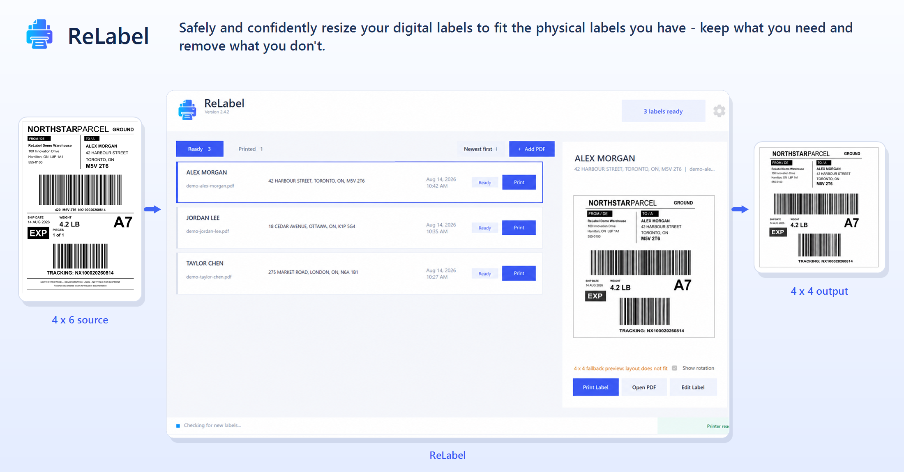
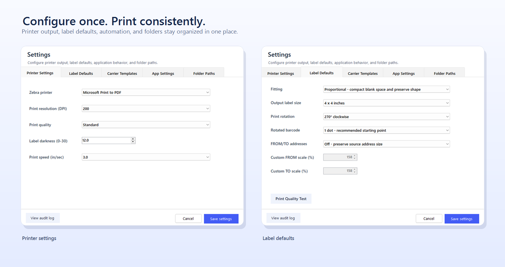
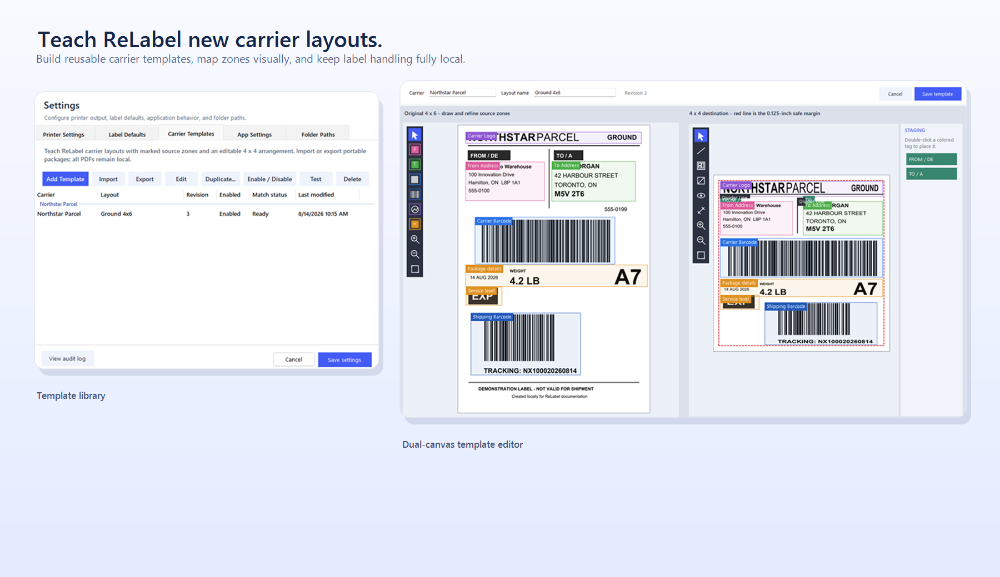

<p align="center">
  
</p>

<h1 align="center">ReLabel</h1>

<p align="center">
  <strong>Safely and confidently resize your digital labels to fit the physical labels you have—keep what you need and remove what you don't.</strong>
</p>

<p align="center">
  Windows 11 &nbsp;|&nbsp; Local processing &nbsp;|&nbsp; Zebra RAW ZPL &nbsp;|&nbsp; 203, 300, and 600 DPI
</p>

ReLabel watches a folder for PDF shipping labels, keeps the originals organized, produces a print-accurate preview, and sends optimized ZPL directly to an existing Zebra Windows queue. The current release is **2.4.4**.



> The screenshots in this README use fictional Northstar Parcel labels created locally for documentation. They contain no customer addresses or production barcode values.

The transformation example uses a native [Northstar Parcel 4 x 6 example PDF](output/pdf/Northstar-Example-4x6.pdf), not a padded 4 x 4 image.

## What ReLabel solves

Shipping systems commonly provide 4 x 6 or Letter-size output even when the available Zebra media is a different size. ReLabel gives the operator a reliable local workflow:

1. A user prints or saves a PDF into the shared Incoming folder.
2. ReLabel waits for the network copy to finish.
3. The PDF moves into Ready and an untouched copy is stored in Archive.
4. ReLabel identifies the recipient, prepares the configured label size, and displays the exact output preview.
5. The operator prints from the row or preview panel.
6. After the Windows Zebra queue accepts the job, the PDF moves into Printed for reprinting or audit.

ReLabel does not install a virtual printer, Windows service, IPP endpoint, or tray process.

## What can ReLabel be used for?

ReLabel can be used as a label-conversion tool, a focused shipping-label print manager, or both.

### Resize shipping labels

Safely resize and scale digital shipping labels to match the physical media loaded in the printer. ReLabel can prepare a carrier's 4 x 6 or Letter-size source for a different supported label size while preserving required addresses, routing information, and barcodes.

This is useful when:

- The shipping platform does not offer the physical label size you have available.
- A carrier label needs to fit smaller or longer media.
- Different printers or workstations use different label stock.
- The label needs rotation, margin protection, barcode correction, or address-size adjustment before printing.

### Remove excess label content

Use carrier templates to identify the portions of a shipping label that must be retained and the portions that are flexible or optional. ReLabel can remove unnecessary blank space, promotional content, redundant instructions, document tabs, or other nonessential regions when producing the target layout.

Required addresses and recognized barcodes remain protected. If a template cannot preserve required content or barcode verification fails, ReLabel uses its established fallback instead of silently deleting necessary information.

### Manage and print labels without changing them

ReLabel can also be used purely as a shipping-label queue and printing application. Select a proportional layout with the same input and output size when no rearrangement or scaling is needed, then use ReLabel to organize, preview, print, reprint, and audit the labels.

This works for:

- A single person preparing and shipping their own orders.
- A small team sharing one Incoming folder and Zebra printer.
- An office creating orders while a separate warehouse team packages and prints them.
- Multiple employees submitting labels to one organized Ready queue.
- A warehouse retaining a searchable Printed history for controlled reprints and auditing.

Because Incoming can be shared over the local network, office staff can save labels without needing direct access to the warehouse printer. ReLabel imports each completed PDF, displays the recipient and destination for the warehouse operator, and moves successfully printed files into Printed for later review or reprinting.

## Highlights

- Clean Ready and Printed queues with recipient, destination address, import time, and per-row print controls.
- Multi-page shipment PDFs remain one queue item and print every label page in order (for example, 1 of 2 followed by 2 of 2).
- 4 x 4, 4 x 6, and 4 x 8 output with proportional or squish-to-fill fitting.
- A mandatory 0.125-inch safe margin on every output.
- Local OCR, barcode detection, PDF rendering, caching, and ZPL generation.
- Print rotation at 0, 90, 180, or 270 degrees.
- Optional rotated-barcode edge correction from one to five native printhead dots.
- Independent FROM and TO address scaling, including custom percentages.
- Fast, Standard, and High Quality rendering presets.
- Configurable Zebra darkness and print speed.
- Direct RAW ZPL submission through the selected physical Windows printer queue.
- Memory and disk caches for fast repeat previews and prints.
- Optional post-print USB barcode verification, disabled by default.
- A local audit log for imports, prints, setting changes, template decisions, and file deletion.
- Carrier-specific templates with visual source-zone marking and editable 4 x 4 placement.

## Requirements

| Requirement | Details |
| --- | --- |
| Operating system | 64-bit Windows 11 |
| Printer | Zebra printer with an installed and working Windows queue |
| Queue capability | Must accept RAW ZPL |
| Printhead selection | 200 in ReLabel uses the ZM400's native 203-DPI raster; 300 and 600 require matching hardware |
| Input | PDF shipping labels from ShipTime or another shipping system, including multi-page files with one label per page |
| Network use | Optional Windows folder share for the Incoming folder |

Carrier acceptance must still be validated with physical print-and-scan testing. Changing the geometry of a carrier label can be subject to carrier-specific rules.

### Carrier requirements and liability

Shipping-label requirements vary by courier, service, and region, and may change. Users are responsible for checking the applicable courier's current requirements and testing each label layout and barcode before shipping.

In Bytedev.app's local testing, every shipment using a ReLabel-produced label was accepted by the local couriers tested—a 100% ship rate for that test group. This limited experience does not guarantee that other labels or shipments will be accepted, delivered, or free from additional charges.

ReLabel is provided "as is" under the [MIT License](LICENSE). To the extent permitted by applicable law, Bytedev.app and ReLabel's contributors are not liable for labels refused by couriers or for resulting delays, replacement-label costs, surcharges, penalties, or other charges.

## Printer Support

ReLabel supports compatible **4-inch Zebra label printers that understand ZPL or ZPL II**. It does not depend on a particular connection type or printer network address; output is submitted as RAW ZPL through the selected Windows printer queue.

### Supported configurations

- Zebra printers with ZPL/ZPL II support, including the **^GFA** graphic command.
- Physical printheads at 203, 300, or 600 DPI. The **200** option in ReLabel represents Zebra's native 203-DPI resolution.
- Printers and media capable of the selected 4 x 4, 4 x 6, or 4 x 8 output size.
- USB, Ethernet, Wi-Fi, and Windows print-server connections when represented by a working Windows queue.
- Official Zebra/ZDesigner queues, or another queue that passes RAW ZPL to the printer without modifying it.
- Configurations that accept ReLabel's **~SD**, **^PR**, **^PW**, **^LL**, **^FO**, and banded **^GFA** commands.

The Zebra ZM400 is supported when its installed printhead resolution matches the DPI selected in ReLabel. Many ZD- and ZT-series label printers should also work when configured for ZPL, but each physical model and printhead combination must be tested before production use.

### Not currently supported

- Zebra card, receipt, document, or kiosk printers that do not accept ZPL label output.
- EPL-only or CPCL-only printers.
- Narrow mobile printers that cannot load 4-inch media.
- Printhead resolutions other than 203, 300, or 600 DPI.
- Windows queues that render, translate, or otherwise alter RAW ZPL data.
- Direct printing to an IP address without an installed Windows printer queue.

### Validate a new printer

1. Install the official Zebra/ZDesigner driver and confirm its Windows test page or Zebra test label prints.
2. Confirm the queue accepts RAW ZPL and that the printer is operating in ZPL mode.
3. Select the printer's physical printhead resolution in ReLabel.
4. Open **Label Defaults** and run **Print Quality Test**.
5. Print and scan a representative label at the intended darkness, speed, rotation, and media size.

Passing the quality test confirms basic communication and raster output. Carrier labels must still be physically scanned and validated before the printer is treated as production-ready.

## Install

The current installer is [ReLabel-Setup-2.4.4.exe](artifacts/installer/ReLabel-Setup-2.4.4.exe).

1. Copy the installer to the shipping workstation.
2. Close ReLabel if it is running.
3. Run the installer as an administrator and follow the prompts.

From PowerShell:

```powershell
Start-Process .\ReLabel-Setup-2.4.4.exe -Verb RunAs
```

The installer includes the required Microsoft Visual C++ runtime and creates desktop and Start Menu shortcuts.

On a first installation, Setup asks where to create Incoming, Ready, Archive, and Printed. Updating an existing installation skips that page and preserves the folder paths already stored in ReLabel, including non-default and network locations.

## Configure ReLabel

Open the gear icon in the upper-right corner.



### Printer Settings

- **Zebra printer:** Select the existing ZDesigner or Zebra queue.
- **Print resolution:** Select 200 for a 203-DPI ZM400 printhead, or 300/600 only for matching hardware.
- **Print quality:** Fast minimizes preparation time, Standard balances clarity and speed, and High Quality renders PDF vectors at 600 DPI before downsampling.
- **Label darkness:** Sets Zebra's physical 0-30 darkness with ZPL `~SD`. This applies to the complete print job.
- **Print speed:** Select a speed supported by the configured resolution. Slower output can improve fine bars and small text.

Use **Label Defaults > Print Quality Test** to print text, thin-line, Code 128, and QR samples with the active DPI, darkness, and speed.

### Label Defaults

Defaults apply to labels imported afterward. Existing labels keep their individual settings.

- Fitting mode and output label size.
- Print rotation.
- Rotated-barcode edge correction.
- Address enhancement mode.
- Independent custom FROM and TO scaling percentages.

### App Settings

- Folder watching.
- Automatic printing after import.
- Optional USB barcode verification after printing.

### Folder Paths

| Folder | Purpose |
| --- | --- |
| Incoming | Network-share or local drop folder watched for new PDFs |
| Ready | Live source for labels shown on the Ready tab |
| Archive | Untouched originals organized by year, month, and recipient |
| Printed | Successfully submitted labels organized for reprinting |

Incoming, Ready, Archive, and Printed must be separate, non-nested locations.

## Daily operation

- Save a PDF into Incoming or click **Add PDF**.
- Select a Ready row to load the composed preview.
- Click **Print** on the row or **Print Label** beside the preview.
- Use **Open PDF** to inspect the untouched original.
- Use **Edit Label** to override size, fitting, rotation, barcode correction, address scaling, or template selection for one label.
- Switch to Printed to reprint, verify, or delete a completed label.
- Sort either queue newest-first or oldest-first.

Duplicate input filenames are renamed safely with `(1)`, `(2)`, and later suffixes. Deleting a managed Ready or Printed PDF externally removes its catalog entry and associated archive copy. Printed labels expire automatically after 48 hours unless they are deleted sooner.

After printing, ReLabel stays on the current tab. The footer reports activity on the left and the Windows printer queue state on the right.

## Fitting and print controls

**Proportional** preserves the complete source aspect ratio. **Squish to fill** uses more of the target media but can distort text and barcodes; scan-test it before production use.

For low-confidence layouts, ReLabel removes oversized blank horizontal gaps before fitting. If analysis, packing, or barcode verification cannot meet its safety rules, it prints the complete source through the established fallback and shows a warning. Required content is never silently omitted.

For labels rotated 90 or 270 degrees, edge correction can retract the thermal trailing edge of detected 1D bars by one to five native dots. ReLabel re-verifies the barcode after each attempt and steps down automatically when a requested strength does not survive.

Address enhancement modifies only OCR-located or template-marked FROM and TO areas. Custom FROM scaling supports 100-450%; custom TO scaling supports 100-250%. ReLabel fits both sides independently and retains the original label canvas and barcode scale.

## Carrier templates

Carrier templates teach ReLabel the stable structure of genuine 4 x 6 carrier layouts. Letter-size inputs remain on the generalized processing path.



Open **Settings > Carrier Templates** to:

- Add, edit, duplicate, enable, disable, test, or delete a template.
- Group multiple layouts under the same carrier.
- Import or export portable `.relabel-template` packages.
- Replace the sample PDF while duplicating and retain all existing zones.

The editor provides:

- A left source canvas for FROM Address, TO Address, Carrier Barcode, Shipping Barcode, Carrier Logo, and named Other zones.
- A right 4 x 4 destination canvas with the 0.125-inch safe margin outlined in red.
- A staging area for zones not yet placed.
- Required, Flexible, and Optional priorities for Other zones.
- Built-in FROM/DE and TO/A assets with linked physical scaling.
- Divider lines, locking, layer ordering, multi-selection, alignment, zoom, and edge placement tools.
- Automatic placement based on the original label and a clean preview without editing overlays.

Create a separate template for each genuinely different layout used by a carrier. As the carrier's library gains representative examples - such as domestic, international, service-specific, document-tab, and revised label layouts - ReLabel has more reference structures available and can more accurately select the correct template for an imported label.

Template variety is more valuable than template quantity alone. Avoid creating duplicate or nearly identical templates unless their matching features are meaningfully different, because indistinguishable candidates can make a match ambiguous instead of more accurate.

Confident matches use the saved template snapshot. Ambiguous matches show a warning and ask the operator whether to use the proposed template during manual printing. Automatic printing uses the generalized fallback for ambiguous matches.

Template source PDFs and matching data remain local. Exported packages include the original sample PDF and may contain shipping information, so store and transfer them accordingly.

## Performance and verification

ReLabel caches prepared images and ZPL in memory and under Local AppData. Returning to an unchanged label is normally immediate, and an already-prepared print can usually reach the Windows spooler within two seconds. The three newest Ready labels are preloaded at startup.

Cache keys include the PDF fingerprint, output settings, print settings, rotation, address controls, barcode correction, and carrier-template snapshot. Editing any relevant option invalidates only the affected entries.

The final raster is one-bit monochrome at the selected printhead resolution. ReLabel emits dynamically sized ZPL `^GFA` bands and verifies detected barcode payloads after composition whenever the processing path supports verification.

## Audit, privacy, and retention

PDF rendering, OCR, barcode decoding, template matching, and print preparation happen locally. No cloud renderer or external API is used.

Open **Settings > View audit log** for a readable history of:

- Imports and archive creation.
- Print preparation and spool submission.
- Successful prints and reprints.
- Managed-file deletion and automatic expiration.
- Label-setting and template changes.
- Template imports, exports, tests, matching decisions, and per-label overrides.

The audit log does not store addresses, OCR text, barcode payloads, or scanner input.

Uninstalling removes ReLabel and its shortcuts while preserving user settings and managed PDF folders.

## Planned Features

The following items describe the intended direction for future ReLabel releases. They are roadmap concepts, not capabilities included in version 2.4.4, and their final design may change after printer, carrier, and platform testing.

### Wider label-size support

- Additional 4-inch carrier formats such as 4 x 6.25, 4 x 6.5, 4 x 6.75, 4 x 8.25, 4 x 8.5, 4 x 9, 4 x 10.5, and 4 x 11.
- Metric formats such as 100 x 150 mm, 100 x 200 mm, and A6.
- Compact parcel, return, document-tab, tire-label, customs, and extended-area formats.
- Separate input-page and physical-output dimensions so ReLabel can accept a carrier's native layout while targeting the media actually loaded in the printer.
- Per-size safe margins, rotation defaults, template layouts, preview validation, and printer capability checks.

### Wider label-printer support

- Capability detection for more Zebra desktop, industrial, mobile, and legacy ZPL printers.
- Validation of printable width, physical printhead resolution, supported print speeds, media length, and RAW-language compatibility.
- Model-specific quality recommendations and reusable printer profiles.
- Clear compatibility reporting before a label is sent instead of relying only on a failed Windows print job.
- Investigation of additional printer languages and non-Zebra thermal printers where reliable raster output and status reporting can be guaranteed.

### Commerce-platform integrations

Shopify is the first planned commerce integration, with other marketplaces and order-management platforms considered afterward.

A proposed integrated workflow is:

1. The commerce platform creates a shipping label for an order.
2. An authorized integration hands the label and minimum required order reference to ReLabel.
3. ReLabel imports, prepares, previews, and prints the label through the configured local printer.
4. If scanner verification is enabled, the operator scans the printed label after attaching it to the package.
5. ReLabel confirms that the scan corresponds to the expected shipment.
6. ReLabel sends a status update to the commerce platform indicating that the order has been packaged and is ready for shipping.

The integration is intended to be opt-in and failure-safe. ReLabel should never mark an order ready when printing or verification fails, and audit records should avoid storing addresses, barcode payloads, or commerce-platform credentials. Authentication, retry handling, duplicate-event protection, and an administrator-visible integration status will be required before this workflow is considered production-ready.

## Release archive

Authentic recoverable historical installers and their SHA-256 hashes are documented in the [installer archive](artifacts/installer/archive/README.md). Do not create rollback installers by renaming a newer binary as an older release.

## Development

```powershell
.\scripts\Build-ReLabel-Release.ps1
.\scripts\Build-ReLabel-Installer.ps1
```

The solution contains:

- **ReLabel:** .NET 8 Windows desktop application.
- **ReLabel.Core:** PDF raster, composition, barcode, and ZPL processing.
- **ReLabel.Tests:** automated regression and behavior tests.

The release build restores dependencies, runs the test suite, and publishes a self-contained Windows x64 application. The installer build packages that publish output with Inno Setup.

## License and contributions

ReLabel is open source under the [MIT License](LICENSE). You may use, modify, and build upon it, including for commercial projects, provided you keep the copyright and license notice with copies or substantial portions of the software. Third-party dependencies retain their own licenses.

Code contributions are welcome through pull requests. By submitting a contribution, you agree to license it under the same MIT License; please include tests for behavior changes when practical.

<hr>

<footer>
  <p><em>© 2026 ReLabel by Bytedev.app</em></p>
</footer>
